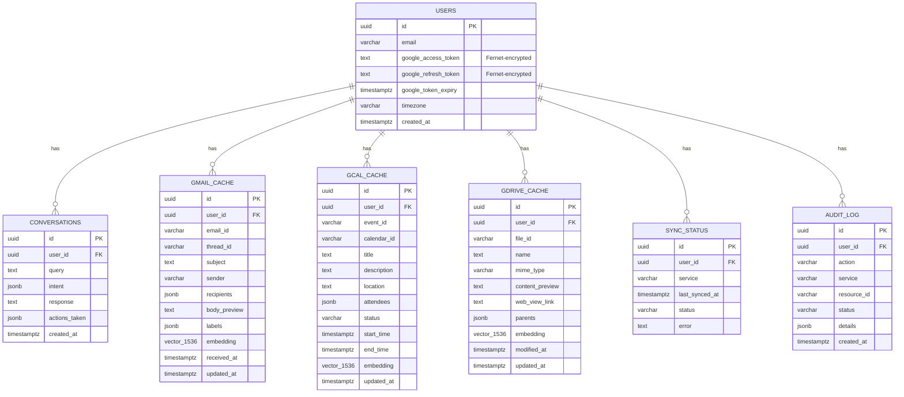

# ER Diagram

Generated from `app/db/models.py` / `alembic/versions/0001_initial.py`. Renders as a
diagram automatically on GitHub (Mermaid support in Markdown).

Notes:
- Every `*_CACHE` table has a `UNIQUE(user_id, <external_id>)` constraint (not shown
  above - Mermaid ER syntax doesn't render composite unique constraints) so a
  background re-sync upserts instead of duplicating rows.
- `vector_1536` is pgvector's `vector(1536)` type, each with an `ivfflat` cosine-
  distance index (see `alembic/versions/0001_initial.py`).
- There are no foreign keys *between* `*_CACHE` tables - by design, every table is
  independently partitionable by `user_id`, which is what makes sharding by
  `user_id` (see [DESIGN.md](../DESIGN.md) section 3) a schema-preserving change.
